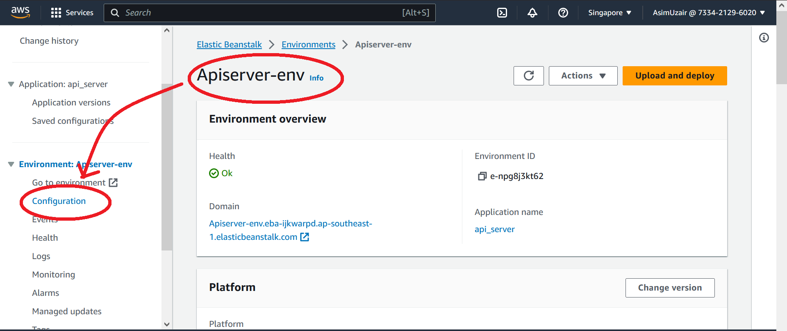
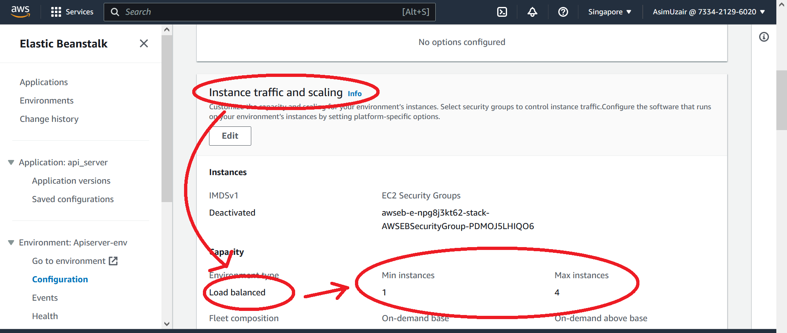
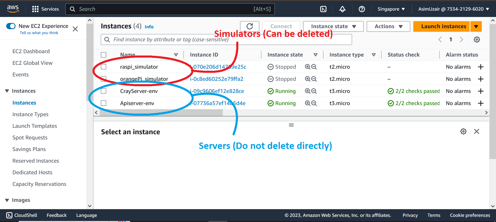
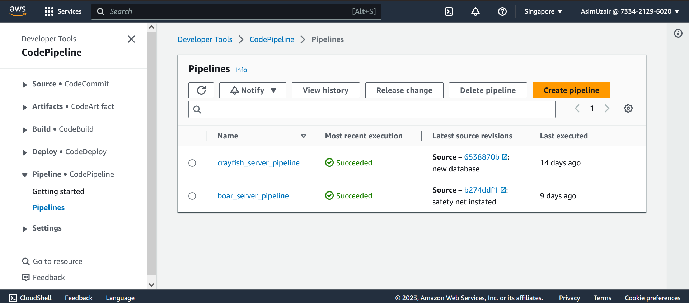
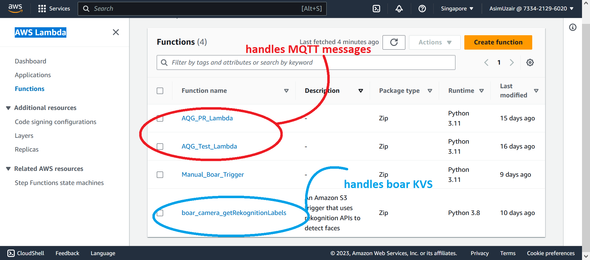
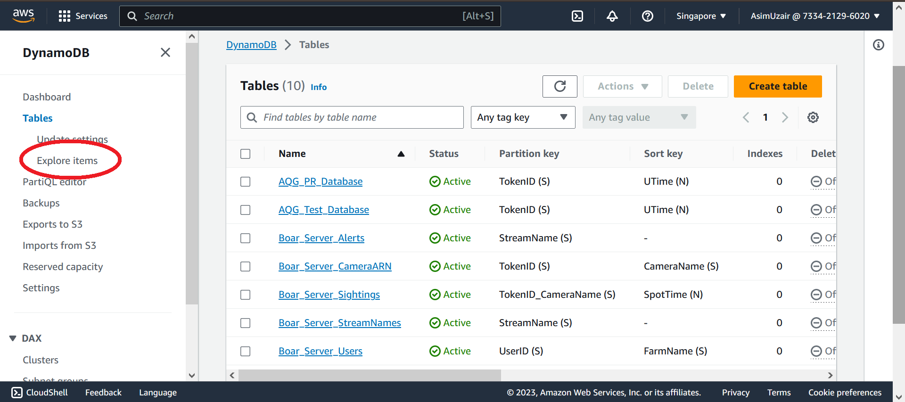
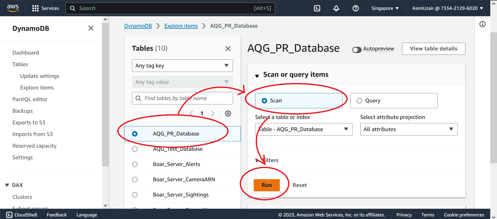
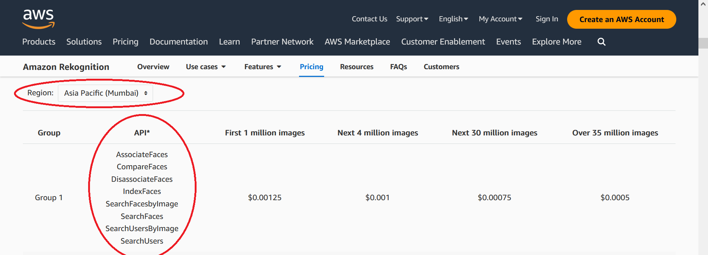

# Summary and list of AWS services used

I will try to list out all the services used, and try to draw out how each component is connected to each other.
By: Uzair

---

## List of Services

### 1. Elastic Beanstalk

Used to host servers. Servers are Node Js apps which make use of other AWS services \(e.g. S3\) no redundant services are kept on Node Js app.

- Apiserver-env  
  Handles the Boar Detection Server
- Crayfishbackend-env  
  Handles the Crayfish Backend Server

---

-> Tips  
Set the balanced load to 0, 0 to turn off server and save cost.  
  

### 2. EC2

The most expensive service being used in our projects.

I currently use this service to create simulators of Raspberry Pi and Orange Pi boards.  
This service is also used by the Elastic Beanstalk to host our Node Js app.

---

-> Tips  
Turning off the Elastic Beanstalk will also turnoff the EC2 and save on costs when not using.  
Deleting the Elastic Beanstalk environment will also delete the EC2 instance.

### 3. CodePipeline

CodePipeline is a developer tool to help link our github repository to our deployment on AWS.
We use this to deploy our code from github to Elastic Beanstalk \(This ability is inbuilt for AWS Amplify, thus we only use this service for elastic beanstalk\).  
Other methods for deployment existed \(Such as using EB cli\) but this provides a GUI for diagnostics.

### 4. Lambda

AWS Lambda allows small code to be triggered on events.

Originally we used these when we wanted to scrape the IAQ api on Tokyo \(All Tokyo code and apps have been moved to Hong Kong\).

Their current use is:

1. Handling MQTT Response and Messages \(Reads Message and Writes to DynamoDB database\)
2. Sending KVS images to Rekognition for Boar Detection. \(Watches S3 for KVS submission and takes the image from S3 to Rekognition for analysis\)

### 5. Kinesis Video Streams

KVS (Kinesis Video Streams) is used to receive video feeds from IoT devices.

We have two methods of analysing KVS videos using Rekognition:

1. Save KVS images in S3 and have a Lambda function feed the Images to Rekognition.
2. Send stream directly to Rekognition

We picked option 1 for boar project because it allowed for better response time and handling when triggered.

---

--> Tips  
You can use Paul Shiners videos on Youtube [Link1](https://www.youtube.com/watch?v=nVxwX7Q9nPU), [Link2](https://www.youtube.com/watch?v=pUvxI76YnfA) to handle the KVS setup.

### 6. DynamoDB

DynamoDB holds all our Databases \(called "tables"\) we can access the elements in the tables by using a unique "Partition key" and "Sort Key".

DynamoDB cannot handle transactions larger than 1MB so we have to implement multiple reads when reading large data.

---

--> Tips  
When working with DynamoDB we can see contents of table using "Explore Table"

### 7. Amazon Rekognition

We do not use this service directly, we can only access it through AWS Lambda.  
This is used to apply Computer Vision on Images and Videos.

---

--> Tips  
We can observe which services are available in certain locations by checking the [pricings](https://aws.amazon.com/rekognition/pricing/). E.g, At the time of writing Mumbai does not have Custom Lable or Label Detection features.

### 8. S3

S3 is used to store Images from KVS Boar, and KVS Temi.  
These Images are then accessed when reviewing screen captures.

### 9. Amazon SNS

Is used to send the SMS and Email notifications. It can also replace Lambda in use for sending HTTP triggers.  
Currently used by Boar Project.

### 10. AWS IoT

IoT things (Raspberry Pi and Orange Pi) are registered and allowed allowed access to KVS.  
IoT Rules allow assigning a Lambda Function to receive and handle MQTT messages.
